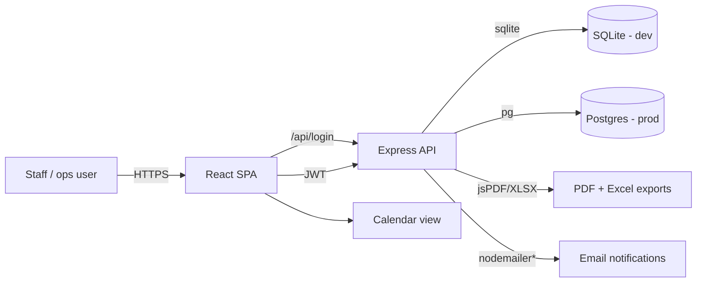

# Fresh Timesheets

Event staffing timesheet, billing, and operations manager for **Fresh People** — a React + TypeScript SPA with an Express + SQLite/Postgres API.

[](LICENSE)
[](package.json)
[](https://github.com/YassinAliYassin/fresh-timesheets/actions/workflows/ci.yml)

## Overview

Fresh Timesheets lets operations staff track event staffing, clock staff in/out,
record timesheets, generate quotations, invoices, billing exports, and PDF
reports — all behind a JWT-authenticated dashboard.

> **Note to contributors:** this repository was previously a blank Vite starter;
> this is the first production documentation pass. Treat the rest of this file as
> the authoritative source of truth.


## Features

- **Timesheet entry** — record staff clock-in/out per shift.
- **Staff & event management** — manage events, addresses, start/end times.
- **Quotations & invoices** — generate client quotations and invoices.
- **Billing export** — export billing data (XLSX).
- **PDF reports** — PDF generation (jsPDF).
- **Email notifications** — notify staff/clients.
- **Calendar view** — upcoming events.
- **Auth** — JWT login, bcrypt-hashed passwords.
- **Dual DB** — SQLite (local) or Postgres (production via `DATABASE_URL`).

## Tech Stack

| Layer | Technology |
|-------|------------|
| Frontend | React 19, TypeScript, Vite 8, Tailwind CSS 4, React Router |
| API | Express 4, JWT (jsonwebtoken), bcryptjs |
| Data | better-sqlite3 (dev) / pg + Postgres (prod) |
| Export | jsPDF, jsPDF-autotable, xlsx |
| Deploy | Render (`render.yaml`), GitHub Actions CI |

## Architecture



## Installation

### Prerequisites

- Node.js 22+ and npm

### Install & run

```bash
git clone https://github.com/YassinAliYassin/fresh-timesheets.git
cd fresh-timesheets
npm install
npm run dev       # Vite dev server (frontend) — connects to the API
```

### API

```bash
node server.js        # Express API on :3000
# or, in production with Postgres:
DATABASE_URL=postgres://... JWT_SECRET=<secret> NODE_ENV=production node server.js
```

## Local Development

```bash
npm run dev      # Vite dev server
npm run start    # Express API
npm run lint     # ESLint
npm run test     # test suite
npm run build    # production build
```

## Deployment

- **Render:** `render.yaml` defines the API service + Postgres database. It
  auto-generates `JWT_SECRET` and wires `DATABASE_URL` from the managed database.
- **CI:** `.github/workflows/ci.yml` runs `npm ci`, lint, test, and build on every
  push/PR to `main`.

## Environment Variables

Create a `.env` for local dev (or use the Render dashboard in production):

| Variable | Required | Purpose |
|----------|----------|---------|
| `PORT` | No | API port (default 3000) |
| `NODE_ENV` | Prod | `production`; forces `JWT_SECRET` to be required |
| `JWT_SECRET` | **Prod yes** | JWT signing secret — **must** be set in production |
| `DATABASE_URL` | Prod | Postgres connection string; otherwise SQLite is used |

> `JWT_SECRET` is mandatory in production. In local dev only, a clearly-marked
> dev fallback is used so the app runs out of the box. Never commit a real secret.

## Folder Structure

```
fresh-timesheets/
├── server.js             # Express API (auth, events, timesheets, quotes, billing)
├── src/
│   ├── main.tsx / App.tsx
│   ├── components/       # Dashboard, TimesheetEntry, Login, CalendarView, Reports, ...
│   ├── hooks/useDarkMode.ts
│   ├── types.ts
│   └── index.css
├── public/               # Static assets (hero preview)
├── render.yaml           # Render deployment config
├── health-check.sh
└── .github/workflows/ci.yml
```

## Contributing

Please read [CONTRIBUTING.md](CONTRIBUTING.md) and our [Code of Conduct](CODE_OF_CONDUCT.md).
Report security issues via [SECURITY.md](SECURITY.md).

## Roadmap

- [ ] Split `server.js` into modular routers.
- [ ] Add API versioning and OpenAPI docs.
- [ ] Add integration tests for the API.
- [ ] Containerize with Docker.

## License

[MIT](LICENSE) © Yassin Ali
